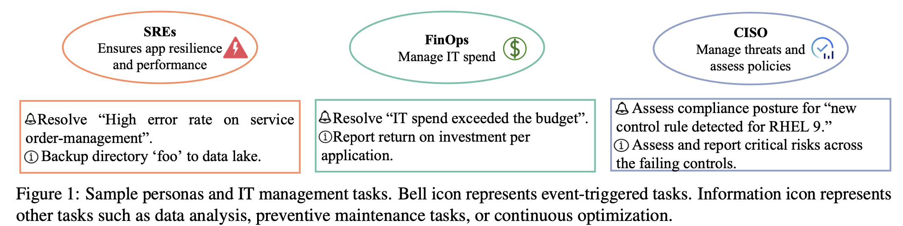

# ITBench

**[Paper](./it_bench_arxiv.pdf) | [Scenarios](#scenarios) | [Agents](#agents) | [Contributors](#contributors)**

This repo contains a sample of task scenarios of our IT-Bench, a framework for benchmarking AI agents to address real-world IT automation tasks.
We targets three key areas:
- Site Reliability Engineering (SRE) - focusing on availability and resiliency
- Compliance and Security Operations (CISO) - ensuring compliance and security of IT implementations
- Financial Operations (FinOps) - enforcing cost efficiencies and optimizing return on investment

## Scenarios
ITBench incorporates a collection of problems that we call scenarios. For example, one of the SRE scenarios in ITBench is to resolve a “High error rate on service order-management” in a Kubernetes environment. Another scenario that is relevant for the CISO persona involves assessing the compliance posture for a “new control rule detected for RHEL 9.” Each of the ITBench scenarios are deployed in an operational environment in which problem(s) occur. 

### CISO Scenarios
Located in [`./ciso`](./ciso)

These scenarios simulate compliance-related misconfigurations. Each scenario provides:
- A pre-configured environment with specific compliance issues
- Tools to detect misconfigurations
- Validation methods to verify successful remediation

### SRE Scenarios
Located in [`./sre`](./sre)

These scenarios focus on observability and incident response. Each scenario includes:
- A comprehensive observability stack deployment featuring:
  - Prometheus for metrics collection
  - Grafana for visualization and single mode of API interactions for agents 
  - Loki for log aggregation
  - Elasticsearch and OpenSearch for search and analytics
  - Jaeger for distributed tracing
  - Kubernetes events exporter
- Simulated faults that trigger service degradation
- Thereby leading to alerts associated with application performance issues such as increased error rates and latency spikes

### FinOps Scenarios
Located in [`./sre`](./sre)

Each scenario includes:
- The core SRE observability stack
- OpenCost integration for cost monitoring
- Simulated faults trigger cost overrun alerts

## Agents
Two baseline agents (SRE-FinOps and CISO) are being open-sourced with the ITBench.
We use the open-source CrewAI framework to create and manage agents.
The agents can be configured to use various LLMs either through watsonx, Azure, or vLLM.
Each agent is initialized with a prompt that describes its goal, the context, the tasks, and the expected output format.
In-context learning examples are included to guide the agent and demonstrate tool usage.
Agents use natural language to access tools to interact with the environment for information gathering.

### CAA Agent
Source code repository [here](https://github.com/IBM/itbench-ciso-caa-agent).

### SRE Agent
Source code repository [here](https://github.com/IBM/itbench-sre-agent).

## Contributors
- Saurabh Jha
- Rohan Arora
- Yuji Watanabe
- Takumi Yanagawa
- Yinfang Chen
- Jackson Clark
- Bhavya Bhavya
- Mudit Verma
- Harshit Kumar
- Hirokuni Kitahara
- Noah Zheutlin
- Saki Takano
- Divya Pathak
- Felix George
- Xinbo Wu{uiuc
- Bekir O Turkkan
- Gerard Vanloo
- Michael Nidd
- Ting Dai
- Oishik Chatterjee
- Pranjal Gupta
- Suranjana Samanta
- Pooja Aggarwal
- Rong Lee
- Pavankumar Murali
- Jae-wook Ahn
- Debanjana Kar
- Ameet Rahane
- Carlos Fonseca
- Amit Paradkar
- Yu Deng
- Pratibha Moogi
- Prateeti Mohapatra
- Naoki Abe
- Chandrasekhar Narayanaswami
- Tianyin Xu{uiuc
- Lav R. Varshney{uiuc
- Ruchi Mahindru
- Anca Sailer
- Laura Shwartz
- Daby Sow
- Nicholas C. M. Fuller
- Ruchir Puri
